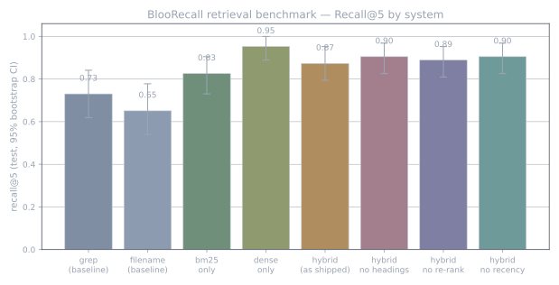

# BlooRecall

**Local, private "where did I write that?" search for your notes — built for coding agents.**

BlooRecall indexes your Markdown / text / reStructuredText and finds files by *meaning and
keyword*, not just filename. It blends BM25 lexical scoring with dense embeddings from a local
[Ollama](https://ollama.com) model, so a search for "how the gateway retries a dropped socket"
finds the note that says "exponential backoff on reconnect" even with no shared words.

It ships a CLI for you and an [MCP](https://modelcontextprotocol.io) server for your coding agent,
over one engine. Everything runs on your machine — no cloud, no API keys, nothing uploaded.

```
$ bloorecall search "how do we retry a dropped socket"
 1. 1.08  ~/notes/gateway/reconnect-design.md
    notes · 2026-08-12 · [OK] disk hash matches
    Reconnect design > Backoff: on disconnect the client waits with exponential backoff...
```

## Why

- **Finds notes by idea, not filename.** Great when you remember *what* you wrote, not *where*.
- **Local and private.** Embeddings come from Ollama on `127.0.0.1`; BlooRecall only reads your
  corpus (read-only) and only writes inside its own project dir.
- **Agent-native.** An MCP tool (`bloorecall_search`) lets an AI assistant look things up itself
  instead of making you paste context. Pairs well with code-structure tools like
  [sem](https://github.com/Ataraxy-Labs/sem): sem knows your *code*, BlooRecall knows your *notes*.
- **Trustworthy results.** Each hit is re-checked against the file on disk and flagged `[OK]` or
  `[DRIFT]`, so an agent never quotes a stale snippet as current.
- **Heading-aware.** Markdown chunks carry their heading trail (`Design > Phased build > P0`), so a
  paragraph matches queries whose words only live in the section titles.
- **Safe by default.** Credential-shaped queries are refused; `secrets`, `credentials`, `.env`,
  `memory` and `sessions` paths are skipped during indexing.

## Install

Requires Python 3.12+, `numpy`, the `mcp` SDK, and a running local Ollama with an embedding model.

```bash
git clone <this repo> && cd bloorecall
pip install numpy mcp
ollama pull qwen3-embedding:0.6b          # any Ollama embedding model works; set it in config
python3 -m unittest discover -s tests     # 65 tests, no network needed
```

Put `bin/` on your `PATH` for a short command, or run `./bin/bloorecall` in place.

## Quick start

```bash
bloorecall init --root ~/notes --root ~/projects   # write config.json for your folders
bloorecall refresh                                 # build the index (incremental after the first run)
bloorecall search "restic backup runbook"
bloorecall status                                  # index size, model, freshness
bloorecall doctor                                  # config / ollama / index / MCP checks
```

If Ollama is down, search still works in keyword-only mode and says so.

## Use it from a coding agent (MCP)

`bloorecall serve` (or `bin/bloorecall-mcp`) is an MCP stdio server exposing one tool,
`bloorecall_search(query, top_k=10, project=None)`. It returns ranked paths with snippets and a
trust note — never whole files.

**Claude Code / any client with `claude mcp`:**

```bash
claude mcp add bloorecall -- /abs/path/to/bloorecall/bin/bloorecall-mcp
```

**Any client with an `mcpServers` config:**

```json
{
  "mcpServers": {
    "bloorecall": { "command": "/abs/path/to/bloorecall/bin/bloorecall-mcp", "args": [] }
  }
}
```

`BLOORECALL_CONFIG=/path/to/config.json` selects a non-default config.

## How it works

1. **Index** (`bloorecall refresh`): walk your corpus roots, apply safety gates, chunk each file
   (heading-aware for Markdown), embed changed chunks via Ollama, store vectors + a BM25 index in
   SQLite. Incremental: an unchanged file is skipped by size/mtime, an edited paragraph re-embeds
   one chunk. A no-change refresh is ~instant.
2. **Search**: embed the query, score every chunk as
   `dense·0.55 + bm25·0.45 + recency·0.05 + metadata·0.15` (a named, editable policy), keep the
   best chunk per file, re-rank the top results with a term-coverage bonus, then verify each hit
   against disk.

## Benchmark

Against a one-pass grep baseline (what an agent gets from a single `rg` search) on a 251-file
synthetic corpus, BlooRecall as shipped reaches **Recall@5 0.87 vs grep's 0.73** (MRR@10 0.77 vs
0.58). In the same run, **embeddings alone did even better** (0.95 / 0.86), and grep was higher on
queries whose answer sits under a heading (0.80 vs 0.70). Tuning the blend is the next step.



Synthetic corpus and queries, one 0.6B embedding model, 63 test queries: treat the gaps between
systems as the signal, not the absolute numbers. Setup, per-category results, an independent
red-team review and one-command reproduction are in [`bench/REPORT.md`](bench/REPORT.md).

## Configuration

`config.json` (write a starter with `bloorecall init`). Key fields: `corpus_roots` (read-only
folders with a `label` and `max_files`), `allowed_extensions`, `embedding` (Ollama model +
endpoint), `policies` / `active_policy` (retrieval weights), `exclusions`, `search_defaults`. All
paths are absolute; the index lives under the project's `var/`.

## Keeping it fresh

`bloorecall refresh` is incremental and idempotent. `scripts/bloorecall-refresh.sh` is a cron-ready
wrapper (its header has a sample crontab line). `bloorecall verify --deep` runs a read-only drift
audit (exit 1 on drift).

## Status

v1. 65 tests, all local. Born as a throwaway tool for personal knowledge-base research that turned
out to be genuinely useful, so it's shared in case it helps you too.

## License

MIT — see [LICENSE](LICENSE).
